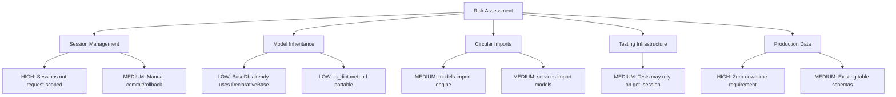
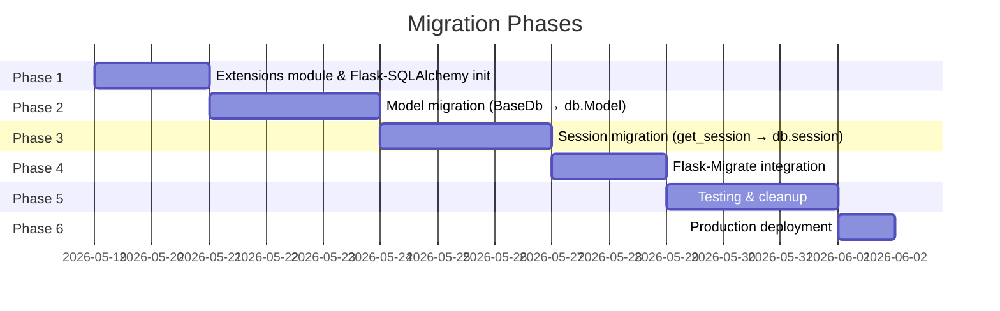
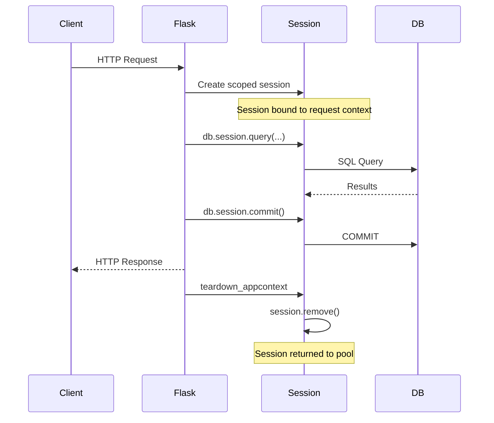
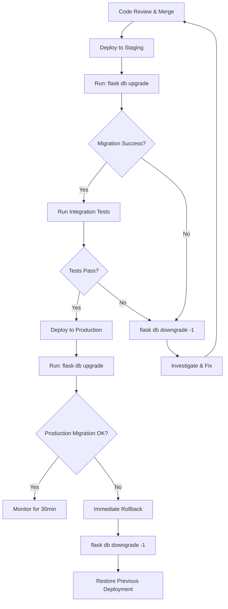
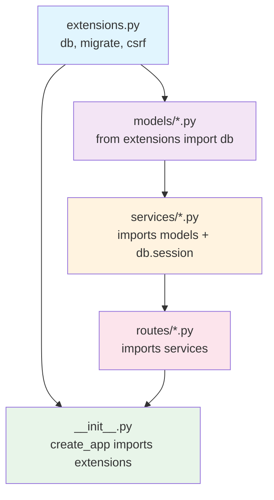

# Complete Migration Plan: Plain SQLAlchemy to Flask-SQLAlchemy

## Production-Ready Migration Guide for Engineering Teams

**Project:** publish_py (mdwikipy.toolforge.org)
**Current Stack:** Flask + plain SQLAlchemy (DeclarativeBase, sessionmaker, manual engine)
**Target Stack:** Flask-SQLAlchemy with Flask-Migrate
**Database:** MySQL (pymysql driver)
**Date:** May 2026

---

## Table of Contents

1. [Current Architecture Assessment](#1-current-architecture-assessment)
2. [Migration Strategy](#2-migration-strategy)
3. [Project Structure Refactor](#3-project-structure-refactor)
4. [Flask-SQLAlchemy Setup](#4-flask-sqlalchemy-setup)
5. [Model Migration](#5-model-migration)
6. [Session & Transaction Management](#6-session--transaction-management)
7. [Alembic / Flask-Migrate Integration](#7-alembic--flask-migrate-integration)
8. [Application Factory Pattern](#8-application-factory-pattern)
9. [Testing Migration](#9-testing-migration)
10. [Performance & Scalability](#10-performance--scalability)
11. [Common Pitfalls](#11-common-pitfalls)
12. [Step-by-Step Execution Timeline](#12-step-by-step-execution-timeline)
13. [Code Examples](#13-code-examples)
14. [Final Deliverables](#14-final-deliverables)

---

## 1. Current Architecture Assessment

### 1.1 Current Project Structure

```
src/
├── app.py                          # WSGI entry point
├── main_app/
│   ├── __init__.py                 # create_app() factory
│   ├── config.py                   # Dataclass-based settings
│   ├── shared/
│   │   ├── engine.py               # BaseDb, init_db(), get_session(), build_engine()
│   │   ├── services/               # Business logic using get_session()
│   │   ├── auth/                   # Authentication layer
│   │   ├── clients/                # External API clients
│   │   ├── core/                   # Extensions, cookies, CSRF
│   │   ├── schemas/                # Data validation
│   │   └── utils/                  # Utility modules
│   ├── admin/                      # Admin blueprint
│   ├── public/                     # Public blueprint
│   └── models/          # ORM models (BaseDb-based)
│       ├── all_articles.py
│       ├── dashboard.py
│       ├── metrics.py
│       ├── pages.py
│       ├── public.py
│       ├── publish.py
│       ├── qid.py
│       ├── setting.py
│       ├── users.py
│       └── views.py
```

### 1.2 Current Patterns in Use

```python
# engine.py - Current Implementation
class BaseDb(DeclarativeBase):
    """Custom base with to_dict() method."""
    def to_dict(self) -> dict[str, Any]: ...

_SessionFactory: sessionmaker | None = None

def init_db(db_url: str, create_tables: bool = False) -> None:
    """Initialize engine and SessionFactory at startup."""
    global _SessionFactory
    engine = build_engine(db_url)
    if create_tables:
        BaseDb.metadata.create_all(engine, tables=real_tables)
    _SessionFactory = sessionmaker(bind=engine, expire_on_commit=False)

def get_session() -> Session:
    """Return a new session."""
    if _SessionFactory is None:
        raise RuntimeError("Call init_db() before using the database.")
    return _SessionFactory()
```

```python
# Service layer pattern - Current
from ..shared.engine import get_session

def get_coordinator(coordinator_id: int) -> CoordinatorRecord | None:
    with get_session() as session:
        orm_obj = session.query(CoordinatorRecord).filter(
            CoordinatorRecord.id == coordinator_id
        ).first()
        return orm_obj
```

```python
# create_app() - Current DB initialization
def create_app(config_class=None):
    app = Flask(__name__, ...)
    if oauth_enabled and settings.database_data.db_host:
        db_url = build_db_url(settings.database_data.to_dict())
        init_db(db_url, True)
    return app
```

### 1.3 Identified Anti-Patterns

| Anti-Pattern                | Location                        | Risk Level | Description                                          |
| --------------------------- | ------------------------------- | ---------- | ---------------------------------------------------- |
| Global mutable state        | `engine.py` (`_SessionFactory`) | **High**   | Module-level singleton makes testing difficult       |
| Manual session lifecycle    | All services                    | **Medium** | `with get_session() as session:` requires discipline |
| No request-scoped sessions  | Services                        | **High**   | Sessions not tied to Flask request lifecycle         |
| Mixed concerns in engine.py | `engine.py`                     | **Medium** | Base class, engine, session, views all in one file   |
| No migration tooling        | Project-wide                    | **High**   | `create_all()` used instead of proper migrations     |
| Tight coupling to MySQL     | `engine.py`                     | **Low**    | `connect_args` specific to MySQL                     |

### 1.4 Migration Risk Analysis



### 1.5 Dependency Map

```
create_app() ──> init_db() ──> build_engine() ──> _SessionFactory
                                                        │
services/* ──> get_session() ──────────────────────────┘
                    │
                    ▼
          session.query(Model)...
                    │
                    ▼
         models/* ──> BaseDb (DeclarativeBase)
```

---

## 2. Migration Strategy

### 2.1 Incremental vs Full Migration

| Criteria              | Incremental (Recommended)        | Full Rewrite                    |
| --------------------- | -------------------------------- | ------------------------------- |
| **Risk**              | Low - changes isolated per phase | High - all-or-nothing           |
| **Rollback**          | Easy - revert single phase       | Difficult - entire app affected |
| **Testing**           | Validate after each phase        | Only validate at end            |
| **Downtime**          | Zero                             | Potential downtime              |
| **Team coordination** | Minimal blocking                 | High blocking                   |
| **Timeline**          | 2-3 weeks                        | 1-2 weeks (if no issues)        |
| **Recommended for**   | Production systems               | Greenfield rewrites             |

**Decision: Incremental Migration** - This project is in production on Toolforge. Zero-downtime incremental approach is mandatory.

### 2.2 Phased Rollout Approach



### 2.3 Backward Compatibility Strategy

During migration, maintain a **compatibility layer** that allows both old and new patterns to coexist:

```python
# shared/compat.py - Temporary compatibility layer
from __future__ import annotations
from .core.extensions import db

def get_session():
    """
    DEPRECATED: Use db.session directly.
    Compatibility wrapper during migration period.
    """
    import warnings
    warnings.warn(
        "get_session() is deprecated. Use db.session directly.",
        DeprecationWarning,
        stacklevel=2,
    )
    return db.session

def init_db(db_url: str, create_tables: bool = False) -> None:
    """
    DEPRECATED: Flask-SQLAlchemy handles initialization.
    Kept for backward compatibility during migration.
    """
    pass  # No-op; Flask-SQLAlchemy manages engine lifecycle
```

### 2.4 Refactoring Priority Order

1. **Extensions module** (foundation - everything depends on this)
2. **Configuration** (Flask-SQLAlchemy config keys)
3. **Models** (change inheritance, keep `to_dict()`)
4. **Services** (replace `get_session()` with `db.session`)
5. **Tests** (update fixtures and mocks)
6. **Cleanup** (remove old engine.py, compat layer)

---

## 3. Project Structure Refactor

### 3.1 Target Directory Structure

```
src/
├── app.py                              # WSGI entry point (minimal changes)
├── main_app/
│   ├── __init__.py                     # create_app() with db.init_app(app)
│   ├── config.py                       # Add SQLALCHEMY_* keys
│   ├── shared/
│   │   ├── engine.py                   # DEPRECATED → compat shim only
│   │   ├── core/
│   │   │   ├── extensions.py           # db = SQLAlchemy(), migrate = Migrate()
│   │   │   └── ...
│   │   ├── models/                     # NEW: Consolidated model package
│   │   │   ├── __init__.py             # Import all models for Alembic discovery
│   │   │   ├── base.py                 # Custom base mixin (to_dict, etc.)
│   │   │   ├── all_articles.py
│   │   │   ├── dashboard.py
│   │   │   ├── metrics.py
│   │   │   ├── pages.py
│   │   │   ├── public.py
│   │   │   ├── publish.py
│   │   │   ├── qid.py
│   │   │   ├── setting.py
│   │   │   ├── users.py
│   │   │   └── views.py
│   │   ├── services/                   # Use db.session instead of get_session()
│   │   ├── auth/
│   │   ├── clients/
│   │   ├── schemas/
│   │   └── utils/
│   ├── admin/
│   │   ├── __init__.py
│   │   ├── routes/
│   │   └── services/
│   ├── public/
│   │   ├── __init__.py
│   │   ├── routes/
│   │   └── services/
│   └── models/              # DEPRECATED → redirect imports to shared/models/
├── migrations/                         # NEW: Alembic migrations directory
│   ├── alembic.ini
│   ├── env.py
│   └── versions/
├── pyproject.toml
└── requirements.txt
```

### 3.2 Blueprint Integration

Blueprints remain unchanged. The key change is how services within blueprints access the database:

```python
# BEFORE (admin/services/coordinator_service.py)
from ...shared.engine import get_session
from ...models.users import CoordinatorRecord

def list_coordinators():
    with get_session() as session:
        return session.query(CoordinatorRecord).all()

# AFTER (admin/services/coordinator_service.py)
from ...shared.core.extensions import db
from ...shared.models.users import CoordinatorRecord

def list_coordinators():
    return db.session.query(CoordinatorRecord).all()
```

### 3.3 Extensions Pattern

All Flask extensions centralized in one module to prevent circular imports:

```python
# src/main_app/shared/core/extensions.py
"""
Centralized Flask extension instances.

Import extensions from here to avoid circular imports.
Extensions are initialized with init_app() in the application factory.
"""
from __future__ import annotations

from flask_sqlalchemy import SQLAlchemy
from flask_migrate import Migrate
from flask_wtf.csrf import CSRFProtect

# Database
db = SQLAlchemy()

# Migrations
migrate = Migrate()

# CSRF Protection (already exists, consolidate here)
csrf = CSRFProtect()
```

---

## 4. Flask-SQLAlchemy Setup

### 4.1 Installation

```bash
pip install flask-sqlalchemy>=3.1.0
pip install flask-migrate>=4.0.0
```

Update `requirements.txt`:

```
flask-sqlalchemy>=3.1.0
flask-migrate>=4.0.0
alembic>=1.13.0
```

### 4.2 Configuration

Add to `config.py` Config classes:

```python
class Config:
    # ... existing settings ...

    # Flask-SQLAlchemy Configuration
    SQLALCHEMY_DATABASE_URI: str | None = None
    SQLALCHEMY_TRACK_MODIFICATIONS: bool = False
    SQLALCHEMY_ENGINE_OPTIONS: dict = {}

    def __init__(self) -> None:
        # ... existing init ...

        # Build database URI from environment
        db_cfg = settings.database_data
        if db_cfg.db_host:
            self.SQLALCHEMY_DATABASE_URI = (
                f"mysql+pymysql://{db_cfg.db_user}:{db_cfg.db_password}"
                f"@{db_cfg.db_host}/{db_cfg.db_name}"
            )

        # Engine options (replaces build_engine kwargs)
        self.SQLALCHEMY_ENGINE_OPTIONS = {
            "pool_pre_ping": True,
            "pool_size": 5,
            "max_overflow": 10,
            "pool_recycle": 3600,
            "connect_args": {
                "connect_timeout": 5,
                "init_command": 'SET time_zone = "+00:00"',
                "charset": "utf8mb4",
                "collation": "utf8mb4_unicode_ci",
            },
        }
```

### 4.3 Environment-Specific Configurations

```python
class DevelopmentConfig(Config):
    SQLALCHEMY_ECHO: bool = True  # Log all SQL queries
    SQLALCHEMY_ENGINE_OPTIONS: dict = {
        "pool_pre_ping": True,
        "pool_size": 2,
        "max_overflow": 5,
        "pool_recycle": 1800,
    }

class TestingConfig(Config):
    SQLALCHEMY_DATABASE_URI: str = "sqlite:///:memory:"
    SQLALCHEMY_ENGINE_OPTIONS: dict = {}  # SQLite doesn't need MySQL options
    SQLALCHEMY_ECHO: bool = False

class ProductionConfig(Config):
    SQLALCHEMY_ENGINE_OPTIONS: dict = {
        "pool_pre_ping": True,
        "pool_size": 10,
        "max_overflow": 20,
        "pool_recycle": 3600,
        "connect_args": {
            "connect_timeout": 5,
            "init_command": 'SET time_zone = "+00:00"',
            "charset": "utf8mb4",
            "collation": "utf8mb4_unicode_ci",
        },
    }
```

### 4.4 Database URI Handling

```python
# Utility function for URI construction with validation
def build_sqlalchemy_uri(db_config: DbConfig) -> str | None:
    """Build SQLAlchemy URI from DbConfig dataclass.

    Returns None if required fields are missing.
    """
    if not all([db_config.db_host, db_config.db_user, db_config.db_name]):
        return None

    # URL-encode password to handle special characters
    from urllib.parse import quote_plus
    password = quote_plus(db_config.db_password or "")

    return (
        f"mysql+pymysql://{db_config.db_user}:{password}"
        f"@{db_config.db_host}/{db_config.db_name}"
        f"?charset=utf8mb4"
    )
```

### 4.5 Session Management Differences

| Aspect           | Plain SQLAlchemy (Current)  | Flask-SQLAlchemy (Target)      |
| ---------------- | --------------------------- | ------------------------------ |
| Session creation | `get_session()` manual call | `db.session` proxy (automatic) |
| Session scope    | Manual `with` block         | Request-scoped (auto-removed)  |
| Commit           | Explicit `session.commit()` | Explicit `db.session.commit()` |
| Rollback         | Explicit in `except` block  | Auto on unhandled exception    |
| Teardown         | Manual close in `with`      | Auto at end of request         |
| Thread safety    | Developer responsibility    | Scoped session handles it      |

---

## 5. Model Migration

### 5.1 Migration Approach

The project already uses `DeclarativeBase` (modern SQLAlchemy 2.0 style). Flask-SQLAlchemy 3.x supports this directly via the `model_class` parameter.

**Key Insight:** We do NOT need to rewrite models to use `db.Model`. Flask-SQLAlchemy 3.x can wrap an existing DeclarativeBase.

### 5.2 Strategy A: Minimal Change (Recommended)

Keep the existing `BaseDb` and register it with Flask-SQLAlchemy:

```python
# shared/core/extensions.py
from flask_sqlalchemy import SQLAlchemy

# Import existing base - NO model changes needed!
from ..engine import BaseDb

db = SQLAlchemy(model_class=BaseDb)
```

This means:

-   All existing models continue to work unchanged
-   `to_dict()` method preserved
-   No import changes in model files
-   Relationships, mixins, everything stays the same

### 5.3 Strategy B: Full Migration (If Deeper Integration Desired)

```python
# shared/models/base.py
from __future__ import annotations
from typing import Any
from ..core.extensions import db

class ModelMixin:
    """Mixin providing common model functionality."""

    def to_dict(self) -> dict[str, Any]:
        """Convert ORM object to dictionary."""
        data = {}
        for column in self.__table__.columns:
            value = getattr(self, column.name)
            if hasattr(value, "isoformat"):
                value = value.isoformat()
            data[column.name] = value
        return data

    def __repr__(self) -> str:
        pk = getattr(self, "id", None)
        return f"<{self.__class__.__name__}(id={pk})>"
```

### 5.4 Model Before/After Comparison

```python
# ==================== BEFORE ====================
# src/main_app/models/users.py

from sqlalchemy import Column, Integer, String, DateTime, Boolean
from ..shared.engine import BaseDb

class UserRecord(BaseDb):
    __tablename__ = "users"

    user_id = Column(Integer, primary_key=True, autoincrement=True)
    username = Column(String(255), nullable=False, unique=True)
    wiki = Column(String(50), nullable=False, default="ar")
    user_group = Column(String(50), nullable=True)
    reg_date = Column(DateTime, nullable=True)


# ==================== AFTER (Strategy A - Minimal) ====================
# src/main_app/models/users.py
# NO CHANGES NEEDED - BaseDb is registered with Flask-SQLAlchemy


# ==================== AFTER (Strategy B - Full) ====================
# src/main_app/shared/models/users.py

from sqlalchemy import DateTime, Integer, String
from sqlalchemy.orm import Mapped, mapped_column
from ..core.extensions import db
from .base import ModelMixin

class UserRecord(ModelMixin, db.Model):
    __tablename__ = "users"

    user_id: Mapped[int] = mapped_column(Integer, primary_key=True, autoincrement=True)
    username: Mapped[str] = mapped_column(String(255), nullable=False, unique=True)
    wiki: Mapped[str] = mapped_column(String(50), nullable=False, default="ar")
    user_group: Mapped[str | None] = mapped_column(String(50), nullable=True)
    reg_date: Mapped[DateTime | None] = mapped_column(DateTime, nullable=True)
```

### 5.5 Relationship Handling

```python
# BEFORE
from sqlalchemy.orm import relationship
from ..shared.engine import BaseDb

class PageRecord(BaseDb):
    __tablename__ = "pages"
    page_id = Column(Integer, primary_key=True)
    user_id = Column(Integer, ForeignKey("users.user_id"))
    user = relationship("UserRecord", backref="pages")

# AFTER (Strategy A - unchanged)
# Same as before - relationships work identically

# AFTER (Strategy B)
from sqlalchemy.orm import Mapped, mapped_column, relationship
from ..core.extensions import db

class PageRecord(db.Model):
    __tablename__ = "pages"
    page_id: Mapped[int] = mapped_column(primary_key=True)
    user_id: Mapped[int] = mapped_column(db.ForeignKey("users.user_id"))
    user: Mapped["UserRecord"] = relationship(backref="pages")
```

### 5.6 Custom Type Migration

The existing `LONGTEXT` TypeDecorator works with both approaches:

```python
# This custom type needs NO changes
class LONGTEXT(TypeDecorator):
    """LONGTEXT for MySQL, Text for everything else."""
    impl = Text
    cache_ok = True

    def load_dialect_impl(self, dialect):
        if dialect.name == "mysql":
            return dialect.type_descriptor(LONGTEXTSQLALCHEMY())
        return dialect.type_descriptor(Text())
```

### 5.7 Naming Conventions

Adopt explicit naming conventions for constraints (important for Alembic):

```python
# In extensions.py or base configuration
from sqlalchemy import MetaData

convention = {
    "ix": "ix_%(column_0_label)s",
    "uq": "uq_%(table_name)s_%(column_0_name)s",
    "ck": "ck_%(table_name)s_%(constraint_name)s",
    "fk": "fk_%(table_name)s_%(column_0_name)s_%(referred_table_name)s",
    "pk": "pk_%(table_name)s",
}

metadata = MetaData(naming_convention=convention)
db = SQLAlchemy(metadata=metadata, model_class=BaseDb)
```

---

## 6. Session & Transaction Management

### 6.1 Core Differences

```python
# ============ BEFORE: Manual Session ============

from ..shared.engine import get_session

def create_page(title: str, user_id: int) -> PageRecord:
    with get_session() as session:
        try:
            page = PageRecord(title=title, user_id=user_id)
            session.add(page)
            session.commit()
            session.refresh(page)
            return page
        except Exception:
            session.rollback()
            raise


# ============ AFTER: Flask-SQLAlchemy Session ============

from ..shared.core.extensions import db

def create_page(title: str, user_id: int) -> PageRecord:
    page = PageRecord(title=title, user_id=user_id)
    db.session.add(page)
    db.session.commit()
    return page
    # No explicit rollback needed - Flask-SQLAlchemy handles on exception
    # No explicit close - session removed at end of request
```

### 6.2 Scoped Sessions

Flask-SQLAlchemy uses `scoped_session` bound to the application context:

```python
# How Flask-SQLAlchemy works internally:
# 1. db.session is a proxy to a scoped session
# 2. Each request gets its own session instance
# 3. Session is removed at end of request via app.teardown_appcontext

# This means:
# - Thread-safe by default
# - No session leaks between requests
# - Automatic cleanup on exceptions
```

### 6.3 Request Lifecycle Integration



### 6.4 Transaction Best Practices

```python
# Pattern 1: Simple CRUD (auto-commit)
def update_user_wiki(user_id: int, wiki: str) -> UserRecord | None:
    user = db.session.get(UserRecord, user_id)
    if user:
        user.wiki = wiki
        db.session.commit()
    return user


# Pattern 2: Multi-operation transaction
def transfer_pages(from_user_id: int, to_user_id: int) -> int:
    """Transfer all pages from one user to another."""
    pages = db.session.query(PageRecord).filter_by(user_id=from_user_id).all()
    for page in pages:
        page.user_id = to_user_id
    db.session.commit()
    return len(pages)


# Pattern 3: Nested transaction (savepoint)
def bulk_import_with_partial_failure(records: list[dict]) -> tuple[int, int]:
    """Import records, skip failures."""
    success, failed = 0, 0
    for record in records:
        try:
            with db.session.begin_nested():  # SAVEPOINT
                obj = PageRecord(**record)
                db.session.add(obj)
            success += 1
        except Exception:
            failed += 1
    db.session.commit()  # Commit all successful inserts
    return success, failed


# Pattern 4: Read-only operations (no commit needed)
def get_active_coordinators() -> list[CoordinatorRecord]:
    return db.session.query(CoordinatorRecord).filter_by(active=True).all()
```

### 6.5 Error Handling Patterns

```python
from sqlalchemy.exc import IntegrityError, OperationalError
from flask import abort

def create_user_safe(username: str, wiki: str) -> UserRecord:
    """Create user with proper error handling."""
    try:
        user = UserRecord(username=username.strip(), wiki=wiki)
        db.session.add(user)
        db.session.commit()
        return user
    except IntegrityError:
        db.session.rollback()
        abort(409, description=f"User '{username}' already exists")
    except OperationalError as e:
        db.session.rollback()
        logger.error("Database operation failed: %s", e)
        abort(503, description="Database temporarily unavailable")


# Decorator pattern for common error handling
from functools import wraps

def handle_db_errors(f):
    """Decorator to handle common database errors."""
    @wraps(f)
    def wrapper(*args, **kwargs):
        try:
            return f(*args, **kwargs)
        except IntegrityError:
            db.session.rollback()
            raise
        except OperationalError:
            db.session.rollback()
            raise
    return wrapper
```

---

## 7. Alembic / Flask-Migrate Integration

### 7.1 Setup

```bash
# Install (already in requirements.txt)
pip install flask-migrate

# Initialize migrations directory
flask db init
```

### 7.2 Configuration in Application Factory

```python
# main_app/__init__.py
from .shared.core.extensions import db, migrate

def create_app(config_class=None):
    app = Flask(__name__, ...)
    # ... config loading ...

    db.init_app(app)
    migrate.init_app(app, db)

    return app
```

### 7.3 Handling Existing Database

Since the database already exists with tables, we need to create a baseline migration:

```bash
# Step 1: Generate migration from current state
flask db migrate -m "baseline: capture existing schema"

# Step 2: Mark as applied WITHOUT running it (tables already exist)
flask db stamp head

# Step 3: Verify
flask db current
```

**Critical:** The baseline migration must match the existing production schema exactly.

```python
# migrations/versions/001_baseline.py
"""baseline: capture existing schema

Revision ID: a1b2c3d4e5f6
"""
from alembic import op
import sqlalchemy as sa

revision = 'a1b2c3d4e5f6'
down_revision = None

def upgrade():
    # Tables already exist - this is a baseline
    # Only included for documentation and new environment setup
    op.create_table('users',
        sa.Column('user_id', sa.Integer(), autoincrement=True, nullable=False),
        sa.Column('username', sa.String(255), nullable=False),
        sa.Column('wiki', sa.String(50), nullable=False),
        sa.Column('user_group', sa.String(50), nullable=True),
        sa.Column('reg_date', sa.DateTime(), nullable=True),
        sa.PrimaryKeyConstraint('user_id'),
        sa.UniqueConstraint('username'),
    )
    # ... other tables ...

def downgrade():
    op.drop_table('users')
    # ... other tables ...
```

### 7.4 Migration Workflow

```bash
# Development workflow
flask db migrate -m "add column: users.email"  # Generate
flask db upgrade                                # Apply locally
# Review generated migration file!
git add migrations/
git commit -m "migration: add users.email column"

# Production workflow
flask db upgrade          # Apply pending migrations
flask db current          # Verify current revision
flask db history          # View migration history
```

### 7.5 Rollback Strategy

```bash
# Rollback last migration
flask db downgrade -1

# Rollback to specific revision
flask db downgrade a1b2c3d4e5f6

# Emergency: rollback all
flask db downgrade base
```

### 7.6 Production Migration Workflow



### 7.7 Alembic env.py Configuration

```python
# migrations/env.py
from flask import current_app
from alembic import context

config = context.config

# Get SQLAlchemy URL from Flask config
config.set_main_option(
    "sqlalchemy.url",
    str(current_app.extensions["migrate"].db.get_engine().url),
)

target_metadata = current_app.extensions["migrate"].db.metadata

# Exclude views from autogenerate
def include_object(object, name, type_, reflected, compare_to):
    if type_ == "table" and object.info.get("is_view"):
        return False
    return True
```

---

## 8. Application Factory Pattern

### 8.1 Refactored `create_app()` Implementation

```python
# src/main_app/__init__.py
"""Flask application factory."""
from __future__ import annotations

import logging
import os
from typing import Type

from flask import Flask

from .config import settings
from .shared.core.extensions import csrf, db, migrate

logger = logging.getLogger(__name__)


def create_app(config_class: Type | None = None) -> Flask:
    """Instantiate and configure the Flask application.

    Args:
        config_class: Configuration class. If None, uses environment settings.

    Returns:
        Configured Flask application instance.
    """
    base_dir = os.path.abspath(os.path.dirname(__file__))
    template_dir = os.path.join(base_dir, "..", "templates")
    static_dir = os.path.join(base_dir, "..", "static")

    app = Flask(
        __name__,
        template_folder=template_dir,
        static_folder=static_dir,
    )
    app.url_map.strict_slashes = False

    # Load configuration
    if config_class is not None:
        app.config.from_object(config_class())
    else:
        _apply_legacy_config(app)

    # Initialize extensions (ORDER MATTERS)
    _init_extensions(app)

    # Register blueprints
    _register_blueprints(app)

    # Register error handlers
    _register_error_handlers(app)

    # Register context processors and filters
    _register_context(app)

    return app


def _init_extensions(app: Flask) -> None:
    """Initialize Flask extensions in correct order."""
    # Database (replaces init_db + build_engine)
    if app.config.get("SQLALCHEMY_DATABASE_URI"):
        db.init_app(app)
        migrate.init_app(app, db)

        # Create tables in development/testing if needed
        if app.config.get("TESTING") or app.config.get("DEBUG"):
            with app.app_context():
                db.create_all()

    # CSRF Protection
    csrf.init_app(app)


def _register_blueprints(app: Flask) -> None:
    """Register all application blueprints."""
    from .admin.routes.admin import bp_admin
    from .public.routes import (
        bp_api, bp_auth, bp_cxtoken, bp_fixrefs,
        bp_leaderboard, bp_main, bp_publish,
    )

    app.register_blueprint(bp_main)
    app.register_blueprint(bp_leaderboard)
    app.register_blueprint(bp_auth)
    app.register_blueprint(bp_cxtoken)
    app.register_blueprint(bp_publish)
    app.register_blueprint(bp_fixrefs)
    app.register_blueprint(bp_api)
    app.register_blueprint(bp_admin)


def _register_error_handlers(app: Flask) -> None:
    """Register HTTP error handlers."""
    # ... (existing error handlers unchanged) ...
    pass


def _register_context(app: Flask) -> None:
    """Register context processors and Jinja filters."""
    from .shared.auth.identity import current_user
    from .db.services.users.coordinator_service import active_coordinators

    @app.context_processor
    def _inject_data():
        user = current_user()
        return {
            "current_user": user,
            "is_authenticated": user is not None,
            "is_admin": bool(user and user.username in active_coordinators()),
            "username": user.username if user else None,
            "oauth_enabled": bool(settings.oauth),
        }
```

### 8.2 Extension Initialization Module

```python
# src/main_app/shared/core/extensions.py
"""
Centralized Flask extension instances.

IMPORT RULE: Always import extensions from this module.
Never instantiate extensions elsewhere.

Usage:
    from main_app.shared.core.extensions import db, migrate, csrf
"""
from __future__ import annotations

from flask_migrate import Migrate
from flask_sqlalchemy import SQLAlchemy
from flask_wtf.csrf import CSRFProtect
from sqlalchemy import MetaData

# Naming convention for constraints (required for reliable Alembic migrations)
convention = {
    "ix": "ix_%(column_0_label)s",
    "uq": "uq_%(table_name)s_%(column_0_name)s",
    "ck": "ck_%(table_name)s_%(constraint_name)s",
    "fk": "fk_%(table_name)s_%(column_0_name)s_%(referred_table_name)s",
    "pk": "pk_%(table_name)s",
}

metadata = MetaData(naming_convention=convention)

# Flask-SQLAlchemy instance
# Strategy A: Use existing BaseDb
from ..engine import BaseDb
db = SQLAlchemy(metadata=metadata, model_class=BaseDb)

# Flask-Migrate instance
migrate = Migrate()

# CSRF Protection
csrf = CSRFProtect()


# Helper functions
def csrf_init_app(app):
    """Initialize CSRF protection."""
    csrf.init_app(app)


def csrf_exempt(app, blueprint):
    """Exempt a blueprint from CSRF protection."""
    csrf.exempt(blueprint)
```

### 8.3 Circular Import Prevention



**Rules to prevent circular imports:**

1. `extensions.py` imports NOTHING from the application
2. Models import ONLY from `extensions.py`
3. Services import models and `db` from extensions
4. Routes import services (never models directly for writes)
5. `create_app()` imports blueprints INSIDE the function body

```python
# WRONG - causes circular import
# extensions.py
from .models.users import UserRecord  # NEVER DO THIS

# CORRECT - lazy imports in factory
# __init__.py
def create_app():
    from .admin.routes.admin import bp_admin  # Inside function = OK
```

---

## 9. Testing Migration

### 9.1 Test Configuration

```python
# conftest.py
import pytest
from main_app import create_app
from main_app.shared.core.extensions import db as _db
from main_app.config import TestingConfig


@pytest.fixture(scope="session")
def app():
    """Create application for testing."""
    app = create_app(TestingConfig)
    return app


@pytest.fixture(scope="function")
def db(app):
    """Create database tables for each test function."""
    with app.app_context():
        _db.create_all()
        yield _db
        _db.session.rollback()
        _db.drop_all()


@pytest.fixture(scope="function")
def session(db):
    """Provide a transactional session for tests."""
    yield db.session
    db.session.rollback()


@pytest.fixture(scope="function")
def client(app, db):
    """Create test client with database."""
    with app.test_client() as client:
        yield client
```

### 9.2 Refactoring Existing Tests

```python
# ============ BEFORE ============
# tests/test_coordinator_service.py

from unittest.mock import patch, MagicMock
from main_app.shared.engine import get_session

def test_get_coordinator():
    mock_session = MagicMock()
    with patch("main_app.db.services.users.coordinator_service.get_session") as mock_gs:
        mock_gs.return_value.__enter__ = MagicMock(return_value=mock_session)
        mock_gs.return_value.__exit__ = MagicMock(return_value=False)
        # ... test logic


# ============ AFTER ============
# tests/test_coordinator_service.py

def test_get_coordinator(db, session):
    """Test with real database session (SQLite in-memory)."""
    from main_app.shared.models.users import CoordinatorRecord

    # Arrange
    coordinator = CoordinatorRecord(name="Test Admin", active=True)
    session.add(coordinator)
    session.commit()

    # Act
    from main_app.db.services.users.coordinator_service import get_coordinator
    result = get_coordinator(coordinator.id)

    # Assert
    assert result is not None
    assert result.name == "Test Admin"
```

### 9.3 Database Fixtures

```python
# tests/factories.py
"""Test data factories."""
from main_app.shared.core.extensions import db
from main_app.shared.models.users import UserRecord, CoordinatorRecord


def create_test_user(username="testuser", wiki="ar", **kwargs) -> UserRecord:
    """Create a test user in the database."""
    user = UserRecord(username=username, wiki=wiki, **kwargs)
    db.session.add(user)
    db.session.commit()
    return user


def create_test_coordinator(name="Admin", active=True, **kwargs) -> CoordinatorRecord:
    """Create a test coordinator."""
    coord = CoordinatorRecord(name=name, active=active, **kwargs)
    db.session.add(coord)
    db.session.commit()
    return coord


# Usage in tests:
def test_user_page_access(client, db, session):
    user = create_test_user(username="author1")
    # ... test logic using this user
```

### 9.4 Transaction Isolation in Tests

```python
@pytest.fixture(scope="function")
def db_session(app):
    """
    Provide a session wrapped in a transaction that rolls back after test.
    This is faster than create_all/drop_all per test.
    """
    with app.app_context():
        connection = _db.engine.connect()
        transaction = connection.begin()

        # Bind session to this connection
        session = _db.session
        session.configure(bind=connection)

        yield session

        # Rollback everything done in test
        transaction.rollback()
        connection.close()
        session.remove()
```

### 9.5 CI/CD Updates

```yaml
# .github/workflows/pytest.yaml
name: Tests
on: [push, pull_request]

jobs:
    test:
        runs-on: ubuntu-latest
        env:
            FLASK_SECRET_KEY: "ci-test-key"
            USE_MW_OAUTH: "false"
            SQLALCHEMY_DATABASE_URI: "sqlite:///:memory:"

        steps:
            - uses: actions/checkout@v4
            - uses: actions/setup-python@v5
              with:
                  python-version: "3.11"
            - run: pip install -r requirements.txt -r requirements-dev.txt
            - run: pytest --tb=short -q
```

---

## 10. Performance & Scalability

### 10.1 Query Optimization

```python
# Eager loading to avoid N+1 queries
from sqlalchemy.orm import joinedload, selectinload

# BEFORE: N+1 problem
def get_users_with_pages():
    users = db.session.query(UserRecord).all()
    for user in users:
        _ = user.pages  # Each access = 1 query!

# AFTER: Eager load
def get_users_with_pages():
    return db.session.query(UserRecord).options(
        selectinload(UserRecord.pages)
    ).all()


# Use .only() for partial column loading
def get_usernames():
    """Only load username column - faster for large tables."""
    return db.session.query(UserRecord.username).all()


# Pagination
def get_pages_paginated(page: int = 1, per_page: int = 20):
    return db.session.query(PageRecord).paginate(
        page=page, per_page=per_page, error_out=False
    )
```

### 10.2 Connection Pooling Configuration

```python
# Production-optimized pool settings
SQLALCHEMY_ENGINE_OPTIONS = {
    # Verify connections before use (handles server restarts)
    "pool_pre_ping": True,

    # Pool sizing: pool_size + max_overflow = max connections
    "pool_size": 10,        # Persistent connections
    "max_overflow": 20,     # Burst connections (temporary)

    # Connection lifecycle
    "pool_recycle": 3600,   # Recycle after 1 hour (MySQL wait_timeout default = 8h)
    "pool_timeout": 30,     # Wait max 30s for available connection

    # MySQL-specific
    "connect_args": {
        "connect_timeout": 5,
        "read_timeout": 30,
        "write_timeout": 30,
        "init_command": 'SET time_zone = "+00:00"',
        "charset": "utf8mb4",
    },
}
```

### 10.3 Session Cleanup

Flask-SQLAlchemy automatically removes sessions at request teardown. For background tasks:

```python
# Background task session management
def run_background_task():
    """Tasks outside request context need explicit cleanup."""
    with app.app_context():
        try:
            # Do work
            results = db.session.query(PageRecord).filter_by(status="pending").all()
            for page in results:
                page.status = "processed"
            db.session.commit()
        except Exception:
            db.session.rollback()
            raise
        finally:
            db.session.remove()  # Explicit cleanup outside request
```

### 10.4 Lazy Loading Considerations

```python
# Default: lazy="select" (loads on access - potential N+1)
# Options:
#   lazy="select"     - Load when accessed (default)
#   lazy="joined"     - Always JOIN
#   lazy="subquery"   - Always subquery
#   lazy="selectin"   - Always SELECT IN
#   lazy="dynamic"    - Returns query object (for large collections)

class UserRecord(db.Model):
    __tablename__ = "users"
    # ...

    # For large collections, use dynamic loading
    pages = relationship("PageRecord", lazy="dynamic")
    # Usage: user.pages.filter_by(status="published").all()

    # For always-needed small relations, use joined
    settings = relationship("UserSettingRecord", lazy="joined")
```

### 10.5 Monitoring Recommendations

```python
# Query logging for performance analysis
import logging
logging.getLogger("sqlalchemy.engine").setLevel(logging.INFO)  # Dev only

# Event-based slow query detection
from sqlalchemy import event
import time

@event.listens_for(db.engine, "before_cursor_execute")
def before_cursor_execute(conn, cursor, statement, parameters, context, executemany):
    conn.info.setdefault("query_start_time", []).append(time.time())

@event.listens_for(db.engine, "after_cursor_execute")
def after_cursor_execute(conn, cursor, statement, parameters, context, executemany):
    total = time.time() - conn.info["query_start_time"].pop(-1)
    if total > 0.5:  # Log queries taking > 500ms
        logger.warning("Slow query (%.2fs): %s", total, statement[:200])
```

---

## 11. Common Pitfalls

### 11.1 Circular Imports

**Problem:** Models import `db` from extensions, extensions imports models for type hints.

```python
# WRONG
# extensions.py
from .models.users import UserRecord  # Circular!

# CORRECT
# extensions.py contains ONLY extension instances
# Models import from extensions (one-way dependency)
```

**Solution:** Always use string references in relationships:

```python
# Use string class name - avoids import
user = relationship("UserRecord", backref="pages")  # String, not class
```

### 11.2 Session Leaks

**Problem:** Sessions not properly closed, especially in error paths.

```python
# WRONG - session leak on exception
def bad_function():
    result = db.session.query(UserRecord).first()
    raise ValueError("oops")  # Session never cleaned up if outside request

# CORRECT - Flask handles within request context automatically
# For code outside request context:
def safe_background_function():
    with app.app_context():
        try:
            result = db.session.query(UserRecord).first()
        finally:
            db.session.remove()
```

### 11.3 Application Context Errors

**Problem:** `RuntimeError: Working outside of application context`

```python
# WRONG - accessing db.session outside app context
def standalone_script():
    users = db.session.query(UserRecord).all()  # RuntimeError!

# CORRECT - push app context
def standalone_script():
    app = create_app()
    with app.app_context():
        users = db.session.query(UserRecord).all()

# CORRECT - in CLI commands
@app.cli.command("seed-db")
def seed_db():
    """App context is automatic in CLI commands."""
    db.session.add(UserRecord(username="admin", wiki="ar"))
    db.session.commit()
```

### 11.4 Migration Conflicts

**Problem:** Multiple developers creating migrations simultaneously.

```
migrations/versions/
├── abc123_add_email.py        (developer A)
└── def456_add_phone.py        (developer B)
    └── Both have same down_revision!
```

**Solution:**

```bash
# After pulling conflicting migrations:
flask db merge heads -m "merge migrations"
# This creates a merge migration that resolves the diamond
```

### 11.5 Production Deployment Risks

| Risk                                                 | Mitigation                                                                           |
| ---------------------------------------------------- | ------------------------------------------------------------------------------------ |
| Long-running migration locks tables                  | Use `ALTER TABLE ... ALGORITHM=INPLACE` for MySQL                                    |
| Migration fails mid-way                              | Always test on staging with production-like data volume                              |
| Rollback needed after data migration                 | Keep data migrations separate from schema migrations                                 |
| `expire_on_commit=True` (default) causing lazy loads | Set `expire_on_commit=False` in engine options or access needed fields before commit |
| `SQLALCHEMY_TRACK_MODIFICATIONS=True` (old default)  | Always set to `False` - causes memory overhead                                       |

### 11.6 The `expire_on_commit` Gotcha

```python
# Flask-SQLAlchemy default: expire_on_commit=True
# This means after commit, accessing attributes triggers a new query

def create_and_return_user(username: str) -> dict:
    user = UserRecord(username=username, wiki="ar")
    db.session.add(user)
    db.session.commit()

    # GOTCHA: This triggers a SELECT because object expired!
    return user.to_dict()

# Solution 1: Access before commit
def create_and_return_user(username: str) -> dict:
    user = UserRecord(username=username, wiki="ar")
    db.session.add(user)
    db.session.flush()  # Assigns ID without committing
    data = user.to_dict()  # Access while still in session
    db.session.commit()
    return data

# Solution 2: Configure expire_on_commit=False
SQLALCHEMY_ENGINE_OPTIONS = {
    "expire_on_commit": False,  # In session_options
}
```

---

## 12. Step-by-Step Execution Timeline

### 12.1 Week-by-Week Roadmap

```
┌─────────────────────────────────────────────────────────────────────────┐
│                        MIGRATION TIMELINE                                │
├──────────┬──────────────────────────────────────────────────────────────┤
│ WEEK 1   │ FOUNDATION                                                    │
│ Day 1-2  │ ▸ Install flask-sqlalchemy, flask-migrate                    │
│          │ ▸ Create extensions.py with db, migrate, csrf                │
│          │ ▸ Add SQLALCHEMY_* config to Config classes                  │
│          │ ▸ Update requirements.txt                                    │
│ Day 3-4  │ ▸ Modify create_app() to call db.init_app(app)              │
│          │ ▸ Keep old init_db() as fallback (feature flag)              │
│          │ ▸ Run existing test suite - must still pass                  │
│ Day 5    │ ▸ Initialize Flask-Migrate: flask db init                    │
│          │ ▸ Create baseline migration                                  │
│          │ ▸ Stamp existing database: flask db stamp head               │
├──────────┼──────────────────────────────────────────────────────────────┤
│ WEEK 2   │ MODEL MIGRATION                                              │
│ Day 1-2  │ ▸ Strategy A: Register BaseDb with SQLAlchemy(model_class=)  │
│          │   OR                                                         │
│          │ ▸ Strategy B: Rewrite models to use db.Model                 │
│          │ ▸ Ensure all models importable from shared/models/__init__   │
│ Day 3-4  │ ▸ Migrate services: replace get_session() → db.session      │
│          │ ▸ Start with lowest-risk services (read-only queries)        │
│          │ ▸ Add deprecation warnings to get_session()                  │
│ Day 5    │ ▸ Migrate write operations (CRUD services)                   │
│          │ ▸ Update error handling patterns                             │
│          │ ▸ Run full test suite                                        │
├──────────┼──────────────────────────────────────────────────────────────┤
│ WEEK 3   │ TESTING & HARDENING                                          │
│ Day 1-2  │ ▸ Refactor test fixtures (conftest.py)                       │
│          │ ▸ Replace mock-heavy tests with real DB tests                │
│          │ ▸ Add integration tests for critical paths                   │
│ Day 3    │ ▸ Remove compatibility layer (get_session shim)              │
│          │ ▸ Remove old engine.py (or reduce to types/LONGTEXT only)    │
│          │ ▸ Update all imports project-wide                            │
│ Day 4    │ ▸ Deploy to staging environment                              │
│          │ ▸ Run flask db upgrade on staging                            │
│          │ ▸ Execute smoke tests and load tests                         │
│ Day 5    │ ▸ Production deployment                                      │
│          │ ▸ Monitor for 24 hours                                       │
│          │ ▸ Document lessons learned                                   │
└──────────┴──────────────────────────────────────────────────────────────┘
```

### 12.2 Team Responsibilities

| Role              | Responsibilities                                         |
| ----------------- | -------------------------------------------------------- |
| **Tech Lead**     | Architecture decisions, code review, rollback decisions  |
| **Backend Dev 1** | Extensions setup, config migration, create_app refactor  |
| **Backend Dev 2** | Model migration, service layer refactoring               |
| **QA Engineer**   | Test refactoring, integration tests, staging validation  |
| **DevOps**        | CI/CD updates, staging deployment, production deployment |

### 12.3 Validation Checkpoints

| Checkpoint           | Criteria                                                                    | Owner              |
| -------------------- | --------------------------------------------------------------------------- | ------------------ |
| **CP-1: Foundation** | `flask db current` returns revision; all existing tests pass                | Backend Dev 1      |
| **CP-2: Models**     | All models importable via Flask-SQLAlchemy; `db.session.query(Model)` works | Backend Dev 2      |
| **CP-3: Services**   | All service functions use `db.session`; no `get_session()` calls remain     | Backend Dev 2      |
| **CP-4: Tests**      | Test suite passes with >90% coverage on service layer                       | QA Engineer        |
| **CP-5: Staging**    | All API endpoints return correct responses on staging                       | QA + Tech Lead     |
| **CP-6: Production** | Zero errors for 24h after deployment                                        | DevOps + Tech Lead |

### 12.4 Rollback Plan

```
ROLLBACK DECISION TREE
═══════════════════════

Issue detected in production?
│
├─ Critical (data corruption, auth failure)
│  └─ IMMEDIATE ROLLBACK
│     1. Revert deployment to previous release
│     2. Run: flask db downgrade <previous_revision>
│     3. Verify application health
│     4. Post-mortem within 24h
│
├─ High (elevated error rates, performance degradation)
│  └─ ASSESS (15 min window)
│     ├─ Worsening? → ROLLBACK (as above)
│     └─ Stable? → Hotfix within 2h or ROLLBACK
│
└─ Low (cosmetic, non-user-facing)
   └─ Fix forward in next release
```

**Pre-deployment rollback preparation:**

```bash
# Before deploying, record current state
flask db current > /tmp/pre_migration_revision.txt
git rev-parse HEAD > /tmp/pre_migration_commit.txt

# Rollback commands (prepared in advance)
git checkout $(cat /tmp/pre_migration_commit.txt)
flask db downgrade $(cat /tmp/pre_migration_revision.txt)
```

---

## 13. Code Examples

### 13.1 Complete CRUD Service (Before/After)

```python
# ════════════════════════════════════════════════════════════════
# BEFORE: src/main_app/shared/services/page_service.py
# ════════════════════════════════════════════════════════════════

from __future__ import annotations
import logging
from typing import Optional
from ..engine import get_session
from ...models.pages import PageRecord

logger = logging.getLogger(__name__)


def get_page(page_id: int) -> Optional[PageRecord]:
    """Get a page by ID."""
    with get_session() as session:
        return session.query(PageRecord).filter(
            PageRecord.page_id == page_id
        ).first()


def get_pages_by_user(user_id: int) -> list[PageRecord]:
    """Get all pages for a user."""
    with get_session() as session:
        return session.query(PageRecord).filter(
            PageRecord.user_id == user_id
        ).order_by(PageRecord.created_at.desc()).all()


def create_page(title: str, user_id: int, wiki: str = "ar") -> PageRecord:
    """Create a new page."""
    title = title.strip()
    if not title:
        raise ValueError("Title cannot be empty")

    with get_session() as session:
        try:
            page = PageRecord(title=title, user_id=user_id, wiki=wiki)
            session.add(page)
            session.commit()
            session.refresh(page)
            return page
        except Exception:
            session.rollback()
            logger.exception("Failed to create page: %s", title)
            raise


def update_page(page_id: int, **kwargs) -> Optional[PageRecord]:
    """Update a page's attributes."""
    with get_session() as session:
        page = session.query(PageRecord).filter(
            PageRecord.page_id == page_id
        ).first()
        if not page:
            return None
        for key, value in kwargs.items():
            if hasattr(page, key):
                setattr(page, key, value)
        try:
            session.commit()
            session.refresh(page)
            return page
        except Exception:
            session.rollback()
            raise


def delete_page(page_id: int) -> bool:
    """Delete a page by ID."""
    with get_session() as session:
        page = session.query(PageRecord).filter(
            PageRecord.page_id == page_id
        ).first()
        if not page:
            return False
        try:
            session.delete(page)
            session.commit()
            return True
        except Exception:
            session.rollback()
            raise
```

```python
# ════════════════════════════════════════════════════════════════
# AFTER: src/main_app/shared/services/page_service.py
# ════════════════════════════════════════════════════════════════

from __future__ import annotations
import logging
from typing import Optional
from sqlalchemy.exc import IntegrityError
from ..core.extensions import db
from ..models.pages import PageRecord

logger = logging.getLogger(__name__)


def get_page(page_id: int) -> Optional[PageRecord]:
    """Get a page by ID."""
    return db.session.get(PageRecord, page_id)


def get_pages_by_user(user_id: int) -> list[PageRecord]:
    """Get all pages for a user."""
    return (
        db.session.query(PageRecord)
        .filter_by(user_id=user_id)
        .order_by(PageRecord.created_at.desc())
        .all()
    )


def create_page(title: str, user_id: int, wiki: str = "ar") -> PageRecord:
    """Create a new page."""
    title = title.strip()
    if not title:
        raise ValueError("Title cannot be empty")

    page = PageRecord(title=title, user_id=user_id, wiki=wiki)
    db.session.add(page)
    try:
        db.session.commit()
    except IntegrityError:
        db.session.rollback()
        logger.exception("Failed to create page: %s", title)
        raise
    return page


def update_page(page_id: int, **kwargs) -> Optional[PageRecord]:
    """Update a page's attributes."""
    page = db.session.get(PageRecord, page_id)
    if not page:
        return None
    for key, value in kwargs.items():
        if hasattr(page, key):
            setattr(page, key, value)
    db.session.commit()
    return page


def delete_page(page_id: int) -> bool:
    """Delete a page by ID."""
    page = db.session.get(PageRecord, page_id)
    if not page:
        return False
    db.session.delete(page)
    db.session.commit()
    return True
```

### 13.2 Flask Route Integration

```python
# ════════════════════════════════════════════════════════════════
# AFTER: src/main_app/public/routes/pages.py
# ════════════════════════════════════════════════════════════════

from flask import Blueprint, jsonify, request, abort
from ...db.services.pages.page_service import (
    get_page, get_pages_by_user, create_page, update_page, delete_page
)
from ...shared.auth.identity import login_required, current_user

bp_pages = Blueprint("pages", __name__, url_prefix="/api/pages")


@bp_pages.route("/", methods=["GET"])
@login_required
def list_pages():
    """List pages for current user."""
    user = current_user()
    pages = get_pages_by_user(user.user_id)
    return jsonify([p.to_dict() for p in pages])


@bp_pages.route("/<int:page_id>", methods=["GET"])
@login_required
def get_page_detail(page_id: int):
    """Get a single page."""
    page = get_page(page_id)
    if not page:
        abort(404, description="Page not found")
    return jsonify(page.to_dict())


@bp_pages.route("/", methods=["POST"])
@login_required
def create_new_page():
    """Create a new page."""
    data = request.get_json()
    if not data or "title" not in data:
        abort(400, description="Title is required")

    user = current_user()
    try:
        page = create_page(
            title=data["title"],
            user_id=user.user_id,
            wiki=data.get("wiki", "ar"),
        )
        return jsonify(page.to_dict()), 201
    except ValueError as e:
        abort(400, description=str(e))


@bp_pages.route("/<int:page_id>", methods=["PATCH"])
@login_required
def update_existing_page(page_id: int):
    """Update a page."""
    data = request.get_json()
    if not data:
        abort(400, description="No data provided")

    page = update_page(page_id, **data)
    if not page:
        abort(404, description="Page not found")
    return jsonify(page.to_dict())


@bp_pages.route("/<int:page_id>", methods=["DELETE"])
@login_required
def delete_existing_page(page_id: int):
    """Delete a page."""
    if not delete_page(page_id):
        abort(404, description="Page not found")
    return "", 204
```

### 13.3 Transaction Example: Bulk Operations

```python
# Complex transaction with savepoints
from ..core.extensions import db
from ..models.publish import PublishRecord
from ..models.pages import PageRecord

def publish_batch(page_ids: list[int], publisher_id: int) -> dict:
    """
    Publish multiple pages in a single transaction.
    Uses savepoints for partial success.
    """
    results = {"published": [], "failed": []}

    for page_id in page_ids:
        try:
            with db.session.begin_nested():  # SAVEPOINT
                page = db.session.get(PageRecord, page_id)
                if not page:
                    raise ValueError(f"Page {page_id} not found")

                publish = PublishRecord(
                    page_id=page_id,
                    publisher_id=publisher_id,
                    status="published",
                )
                db.session.add(publish)
                page.status = "published"
                results["published"].append(page_id)

        except Exception as e:
            results["failed"].append({"page_id": page_id, "error": str(e)})

    # Commit all successful operations
    db.session.commit()
    return results
```

---

## 14. Final Deliverables

### 14.1 Migration Checklist

#### Phase 1: Foundation

-   [ ] `flask-sqlalchemy>=3.1.0` added to requirements.txt
-   [ ] `flask-migrate>=4.0.0` added to requirements.txt
-   [ ] `extensions.py` created with `db`, `migrate`, `csrf` instances
-   [ ] `SQLALCHEMY_DATABASE_URI` added to all Config classes
-   [ ] `SQLALCHEMY_TRACK_MODIFICATIONS = False` set
-   [ ] `SQLALCHEMY_ENGINE_OPTIONS` configured per environment
-   [ ] `create_app()` calls `db.init_app(app)` and `migrate.init_app(app, db)`
-   [ ] `flask db init` executed successfully
-   [ ] Baseline migration created and stamped
-   [ ] Existing test suite passes unchanged

#### Phase 2: Models

-   [ ] BaseDb registered with Flask-SQLAlchemy OR models rewritten
-   [ ] All models importable from consolidated location
-   [ ] `to_dict()` method preserved on all models
-   [ ] Relationships verified and working
-   [ ] Custom types (LONGTEXT) working correctly
-   [ ] Naming convention applied to metadata

#### Phase 3: Services

-   [ ] All `get_session()` calls replaced with `db.session`
-   [ ] All manual `session.commit()` / `session.rollback()` reviewed
-   [ ] Error handling uses `db.session.rollback()` where appropriate
-   [ ] No dangling session references
-   [ ] Deprecation warnings added to old `get_session()` (if kept temporarily)

#### Phase 4: Testing

-   [ ] `conftest.py` updated with new fixtures
-   [ ] Test database uses SQLite in-memory (or test MySQL)
-   [ ] All tests pass with new session management
-   [ ] Integration tests cover critical API endpoints
-   [ ] Coverage maintained at pre-migration levels

#### Phase 5: Cleanup

-   [ ] Old `engine.py` removed or reduced to utility types only
-   [ ] `models/` directory removed (if consolidated)
-   [ ] All deprecated compatibility shims removed
-   [ ] Import paths updated project-wide
-   [ ] No remaining references to `init_db()` or `get_session()`

#### Phase 6: Deployment

-   [ ] Staging deployment successful
-   [ ] `flask db upgrade` runs without error on staging
-   [ ] Smoke tests pass on staging
-   [ ] Production deployment executed
-   [ ] 24-hour monitoring shows no regressions
-   [ ] Rollback procedure tested and documented

---

### 14.2 Risk Matrix

| Risk                                | Probability | Impact   | Severity   | Mitigation                                          |
| ----------------------------------- | ----------- | -------- | ---------- | --------------------------------------------------- |
| Session leak in production          | Low         | High     | **High**   | Flask-SQLAlchemy auto-cleanup; add monitoring       |
| Circular import in models           | Medium      | Medium   | **Medium** | Strict import rules; extensions pattern             |
| Migration breaks existing schema    | Low         | Critical | **High**   | Baseline migration + stamp; staging validation      |
| Performance regression              | Medium      | Medium   | **Medium** | Connection pool tuning; query monitoring            |
| Application context errors          | Medium      | Low      | **Low**    | Ensure all DB access within request/app context     |
| Test suite failures                 | High        | Low      | **Low**    | Incremental test migration; maintain old fixtures   |
| Production downtime during deploy   | Low         | High     | **High**   | Zero-downtime deployment; feature flag for DB layer |
| Rollback needed post-deploy         | Low         | Medium   | **Medium** | Pre-tested rollback procedure; DB snapshots         |
| Data corruption from session misuse | Very Low    | Critical | **Medium** | Code review; transaction isolation in tests         |
| Third-party lib incompatibility     | Very Low    | Medium   | **Low**    | Pin versions; test in isolated environment          |

---

### 14.3 QA Validation Checklist

#### Functional Tests

-   [ ] User authentication and authorization works
-   [ ] All CRUD operations on pages succeed
-   [ ] Coordinator management functions correctly
-   [ ] Publish workflow completes end-to-end
-   [ ] API endpoints return correct status codes and data
-   [ ] Error responses are properly formatted
-   [ ] Pagination works on list endpoints
-   [ ] Search/filter queries return correct results

#### Non-Functional Tests

-   [ ] Response time within acceptable limits (<200ms for reads, <500ms for writes)
-   [ ] No connection pool exhaustion under normal load
-   [ ] Memory usage stable over extended operation
-   [ ] No session leak detected (monitor session count)
-   [ ] Concurrent requests handled correctly (no race conditions)
-   [ ] Database reconnection works after transient failures

#### Regression Tests

-   [ ] All existing API contracts unchanged
-   [ ] Date/time formatting consistent with pre-migration
-   [ ] Unicode data (Arabic text) handled correctly
-   [ ] NULL vs empty string handling preserved
-   [ ] Default values applied correctly
-   [ ] Views (users_list) still functional

---

### 14.4 Production Readiness Checklist

```
PRE-DEPLOYMENT
══════════════
□ All code reviewed and approved
□ All CI tests passing on deployment branch
□ Staging environment validated for minimum 24h
□ Database backup taken (production)
□ Rollback procedure documented and tested
□ On-call engineer identified and briefed
□ Deployment window communicated to team
□ Monitoring dashboards prepared (error rate, latency, connection pool)

DEPLOYMENT
══════════
□ Deploy application code
□ Run: flask db upgrade (if new migrations)
□ Verify application starts without errors
□ Verify health check endpoint responds
□ Verify database connectivity (pool initialized)
□ Run automated smoke tests

POST-DEPLOYMENT (First 30 minutes)
═══════════════════════════════════
□ Monitor error rate (should be ≤ pre-deployment)
□ Monitor response latency (should be ≤ pre-deployment)
□ Monitor connection pool usage
□ Check application logs for warnings/errors
□ Verify critical user flows manually
□ Confirm no session-related errors

POST-DEPLOYMENT (First 24 hours)
════════════════════════════════
□ Monitor memory usage trend
□ Monitor connection pool recycling
□ Check for slow query warnings
□ Verify scheduled tasks still execute
□ Confirm no data inconsistencies reported
□ Mark migration as complete
□ Remove feature flags / compatibility layers (next release)
□ Update documentation and architecture diagrams
```

---

## Appendix A: Architecture Decision Records

### ADR-001: Flask-SQLAlchemy Model Strategy

**Decision:** Use Strategy A (register existing BaseDb with Flask-SQLAlchemy's `model_class` parameter).

**Rationale:**

-   Minimizes code changes across 10+ model files
-   Preserves existing `to_dict()` implementation
-   Avoids breaking service layer imports
-   Can migrate to Strategy B incrementally later if desired

**Consequences:**

-   Models don't get Flask-SQLAlchemy convenience methods (e.g., `Model.query`)
-   Must use `db.session.query(Model)` instead of `Model.query`
-   Custom TypeDecorators (LONGTEXT) work without modification

### ADR-002: Session Management Pattern

**Decision:** Use Flask-SQLAlchemy's request-scoped `db.session` for all operations.

**Rationale:**

-   Eliminates manual session lifecycle management
-   Prevents session leaks
-   Integrates with Flask's request/response cycle
-   Simplifies error handling (auto-rollback on unhandled exceptions)

**Consequences:**

-   Background tasks must explicitly manage application context
-   CLI commands get automatic context from Flask
-   Testing requires proper fixture setup

### ADR-003: Migration Tooling

**Decision:** Use Flask-Migrate (Alembic) for schema migrations.

**Rationale:**

-   Replaces unsafe `create_all()` in production
-   Provides reversible migrations
-   Enables team collaboration on schema changes
-   Industry standard for Flask + SQLAlchemy projects

**Consequences:**

-   New workflow for schema changes (generate → review → apply)
-   Must maintain migration history in version control
-   Baseline migration needed for existing database

---

## Appendix B: Quick Reference

### Import Cheat Sheet

```python
# Database instance
from main_app.shared.core.extensions import db

# Models
from main_app.shared.models.users import UserRecord
from main_app.shared.models.pages import PageRecord

# Common operations
db.session.get(Model, primary_key)     # Get by PK
db.session.query(Model).filter_by()    # Query with keyword args
db.session.query(Model).filter()       # Query with expressions
db.session.add(instance)               # Stage for insert
db.session.delete(instance)            # Stage for delete
db.session.commit()                    # Commit transaction
db.session.rollback()                  # Rollback transaction
db.session.flush()                     # Flush without commit
```

### CLI Commands

```bash
flask db init                    # Initialize migrations (one time)
flask db migrate -m "message"    # Generate migration from model changes
flask db upgrade                 # Apply pending migrations
flask db downgrade -1            # Rollback last migration
flask db current                 # Show current revision
flask db history                 # Show migration history
flask db stamp head              # Mark DB as up-to-date (no SQL run)
flask db merge heads             # Merge conflicting migrations
```

---

_Document Version: 1.0_
_Last Updated: May 2026_
_Authors: Engineering Team_
_Status: Ready for Review_
